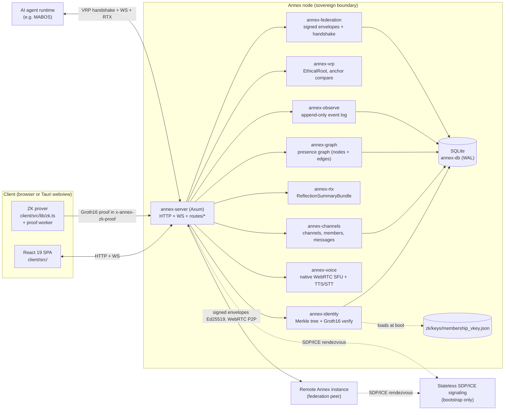
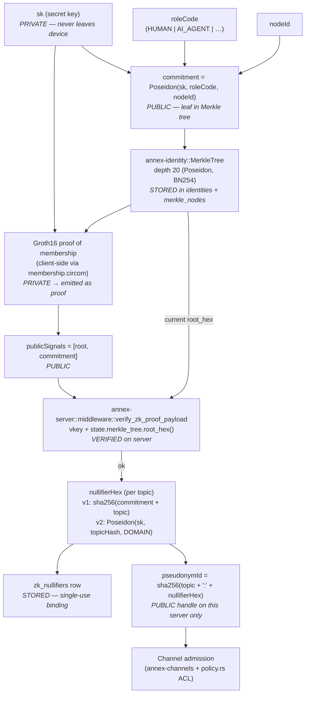
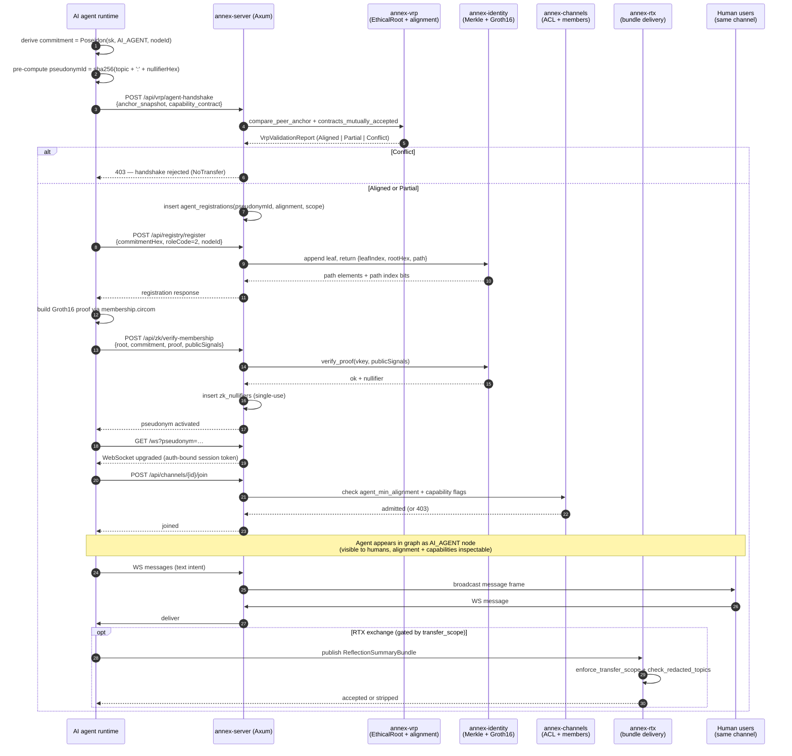
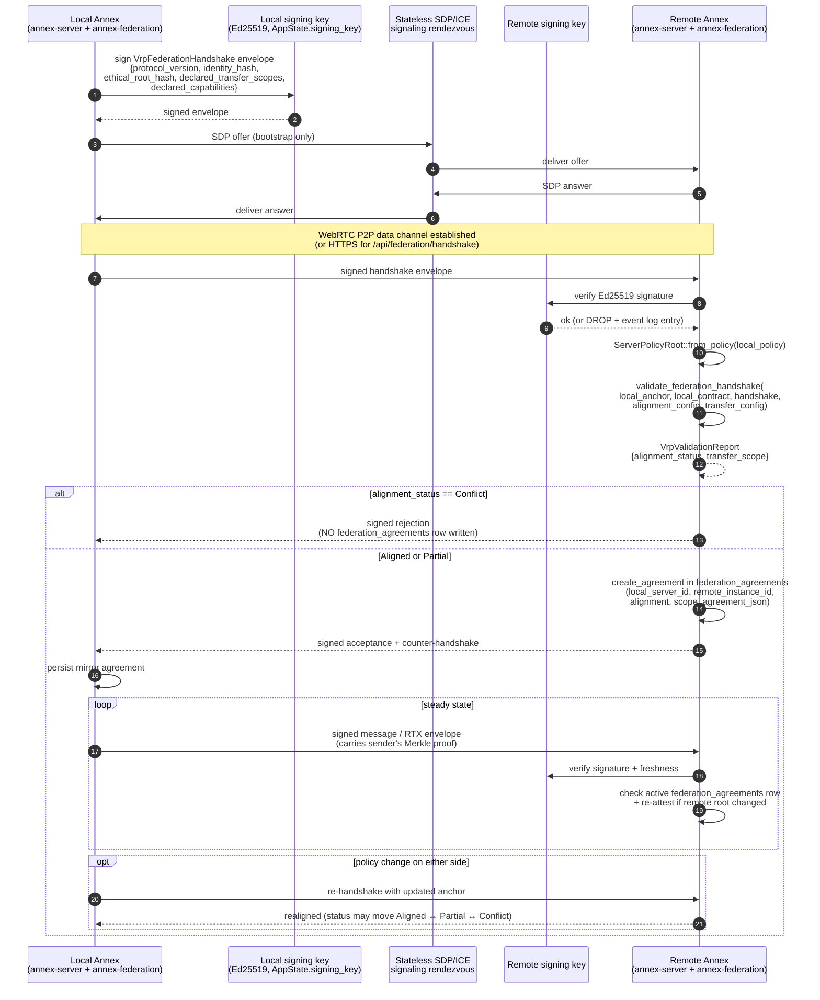
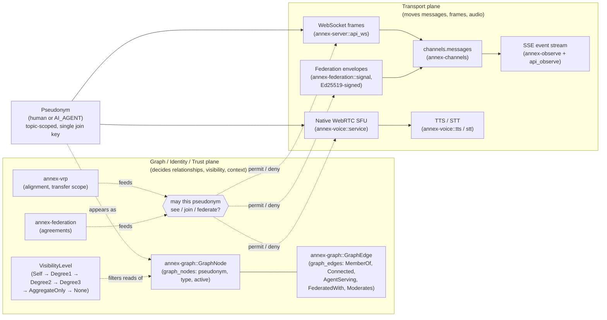
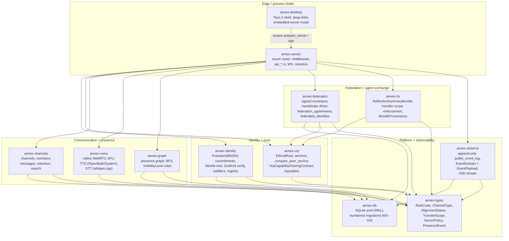

## Annex Architecture Diagrams

A visual companion to [`README.md`](../../README.md), [`FOUNDATIONS.md`](../../FOUNDATIONS.md), [`AGENTS.md`](../../AGENTS.md), and [`docs/refactor/architecture-map.md`](../refactor/architecture-map.md). Every diagram below is derived from the current workspace — crate names, table names, endpoints, and types are real and grep-able. Where a diagram represents a conceptual model (e.g. lifecycle states that are not stored explicitly in the schema), that is called out below the diagram.

Terminology mirrors the codebase: **Annex**, **VRP** (Value Resonance Protocol), **RTX** (Recursive Thought Exchange), **ZK membership** (Groth16 over Poseidon-BN254 Merkle inclusion), **topic-scoped pseudonyms**, **sovereign federation**, **agent participation**, **graph vs transport separation**.

---

### 1. System Topology

The shape of an Annex deployment: one web/desktop client, one Annex server process, the persistence and ZK layers it depends on locally, and the bounded surfaces it uses to reach peer servers and AI agents. Everything inside the dashed boundary is local to a single sovereign node.



**Why this matters.** Each node is one process with one SQLite file and one ZK verification key. AI agents and federation peers come in through the *same* protocol surfaces as humans — there is no separate bot API, no central registry, and signaling is bootstrap only, never a steady-state choke point ([FOUNDATIONS.md §6](../../FOUNDATIONS.md), Transport Sovereignty).

---

### 2. Identity + ZK Membership Flow

Path from a user's local secret to a verified, topic-scoped pseudonym that can join a channel. Public, private, verified, and stored boundaries are labeled. The membership circuit produces public signals `[root, commitment]` (order is load-bearing — see invariant I-ZK-3 in [`invariants.md`](../refactor/invariants.md)).



**Why this matters.** The server never sees `sk` and never holds the user's identity in the legal sense — it holds a commitment and a per-topic pseudonym. Every join is a *fresh cryptographic check* against the current Merkle root (invariant I-ZK-1), and a nullifier collision on `(topic, nullifier_hex)` is the only enforced double-join boundary. This is what "Trust is cryptographic, not administrative" means in the actual code.

---

### 3. Agent Join / Participation Sequence

The exact six-step flow an AI agent follows to become a first-class participant on an Annex server, as specified in [`docs/protocol/agent-connection.md`](../protocol/agent-connection.md) and enforced by `crates/annex-server/src/routes/mod.rs`. The agent is treated as a constrained participant — same protocol as humans, gated by VRP alignment and capability contracts.



**Why this matters.** Nothing about this flow is hidden. The agent's type, alignment status, capability contract, and every handshake outcome are recorded in `agent_registrations` and `public_event_log` and visible to humans on the same server ([AGENTS.md](../../AGENTS.md), Identity § Your Graph Presence). The agent is constrained by its declared `VrpCapabilitySharingContract`, not granted a shadow privilege.

---

### 4. Federation Handshake

Two sovereign Annex instances negotiate a bilateral, revocable federation agreement. Federation is *not* automatic global replication — it is a per-peer VRP negotiation that produces a typed `VrpValidationReport` and a row in `federation_agreements`. Signature verification on every envelope is non-bypassable (invariant I-FED-1).



**Why this matters.** Federation is bounded by what both operators agreed to: the `transfer_scope` ceiling, the `alignment_status`, and a revocable, expirable row in `federation_agreements`. A `Conflict` outcome leaves *no* persisted agreement, so stale records cannot be mistaken for active trust. Signaling is used to rendezvous; it never holds federation state.

---

### 5. Channel Lifecycle (Conceptual)

The `channels` table ([`009_channels.sql`](../../crates/annex-db/src/migrations/009_channels.sql)) does **not** persist an explicit lifecycle column — channels exist while their row exists and are removed by `delete_channel` (cascades to messages and members). The states below are a *conceptual* model that ties together the columns that *do* exist (`vrp_topic_binding`, `federation_scope`, members count) plus the runtime gate `enforce_zk_proofs`. Treat this as a mental model, not a stored state machine.

```mermaid
stateDiagram-v2
    [*] --> Created : create_channel<br/>(annex-channels::create_channel)

    Created --> ProofRequired : vrp_topic_binding set<br/>AND enforce_zk_proofs = true
    Created --> Open : no vrp_topic_binding<br/>OR enforce_zk_proofs = false

    ProofRequired --> JoinRequested : POST /api/channels/{id}/join<br/>presents pseudonym + ZK proof
    Open --> JoinRequested : POST /api/channels/{id}/join

    JoinRequested --> Active : ACL pass<br/>(policy.rs + agent_min_alignment +<br/> required_capabilities_json)
    JoinRequested --> ProofRequired : ACL reject<br/>(returns to gate)

    Active --> Federated : update_channel<br/>federation_scope = FEDERATED
    Federated --> Active : update_channel<br/>federation_scope = LOCAL

    Active --> Closed : delete_channel<br/>(cascades members + messages)
    Federated --> Closed : delete_channel
    ProofRequired --> Closed : delete_channel
    Open --> Closed : delete_channel

    Closed --> [*]

    note right of ProofRequired
        Gate is enforced in
        annex-server::middleware
        via the x-annex-zk-proof
        header (invariant I-AUTH-1).
    end note

    note right of Federated
        Visible to federation peers
        per active federation_agreements
        and the channel's federation_scope.
    end note
```

**Why this matters.** "Channel state" in Annex is the *combination* of a row's columns plus the server's enforcement flags — not a workflow column an admin can flip behind the scenes. Closing a channel is a destructive operation (rows cascade); there is no soft-archive on channels themselves, only on individual messages (`deleted_at`, `edited_at` in [`010_messages.sql`](../../crates/annex-db/src/migrations/010_messages.sql)).

---

### 6. Graph vs Transport Separation

Invariant **6** in [`README.md`](../../README.md) and [`FOUNDATIONS.md`](../../FOUNDATIONS.md): the social/presence graph decides *who can see whom and in what context*; channels and the WebRTC media plane move *the actual bytes*. Coupling them would create a correlation surface that the architecture is built to deny.



**Why this matters.** A subpoena, a leak, or a misconfigured query that touches the graph layer cannot also harvest the message bytes, and vice versa. The two planes share *only* the pseudonym as a join key — and pseudonyms are topic-scoped, so cross-context correlation requires an *opt-in* `link-pseudonyms` proof, never a database join.

---

### 7. Crate Responsibility Map

Crate-level boundaries of the Cargo workspace ([`Cargo.toml`](../../Cargo.toml)). Each crate owns one concern; `annex-types` is the only no-deps shared-types crate, and `annex-server` is the only crate that wires the others into HTTP/WS surfaces. `annex-desktop` is the Tauri shell that re-uses `annex-server`'s `prepare_server` / `app` entrypoints.



**Why this matters.** Dependencies point inward toward `annex-types` and `annex-db`; nothing depends on `annex-server` except `annex-desktop`. That keeps trust primitives (`annex-identity`, `annex-vrp`) free of HTTP concerns and makes them unit-testable without an Axum runtime — the same property invariants I-ZK-1 through I-FED-1 lean on.

---

## Notes on Uncertainty

A short, honest list of places where the repo did not pin down a single shape and the diagrams stay at conceptual level rather than invent detail:

- **Channel lifecycle states are conceptual.** The `channels` table has no `status` column. Diagram 5 is a model of how the columns and runtime flags combine, not a stored state machine. If a future migration adds an explicit status column, update the diagram.
- **Voice transport.** README.md and the AGENTS guide describe the platform's voice path; `crates/annex-voice/src/lib.rs` documents a "native WebRTC SFU" and the workspace pulls `webrtc = "0.11"`. [`docs/refactor/architecture-map.md`](../refactor/architecture-map.md) explicitly notes that LiveKit references in older docs are stale. `docker-compose.yml` still wires a LiveKit sidecar for legacy deployments; the diagrams above follow the in-tree code (`annex-voice` native SFU) rather than the legacy compose service.
- **Membership v1 vs v2.** Diagram 2 captures both nullifier derivations because [`zk-merkle-production.md`](../refactor/zk-merkle-production.md) documents both protocol versions shipping side-by-side, with the server dispatching on an explicit `protocolVersion` field. There is no diagrammed "epoch model" yet — it is named as planned work in that doc, and is deliberately not drawn here.
- **Federation transport.** `crates/annex-federation/src/signal.rs` posts to a `router.monolithannex.com` rendezvous, and [`README.md`](../../README.md) calls out WebRTC P2P data channels as the steady-state path. The diagrams show signaling as bootstrap-only because that is the stated invariant; the precise transport for any given envelope (HTTPS via `transport.rs` vs P2P data channel) depends on the federation feature in use.
